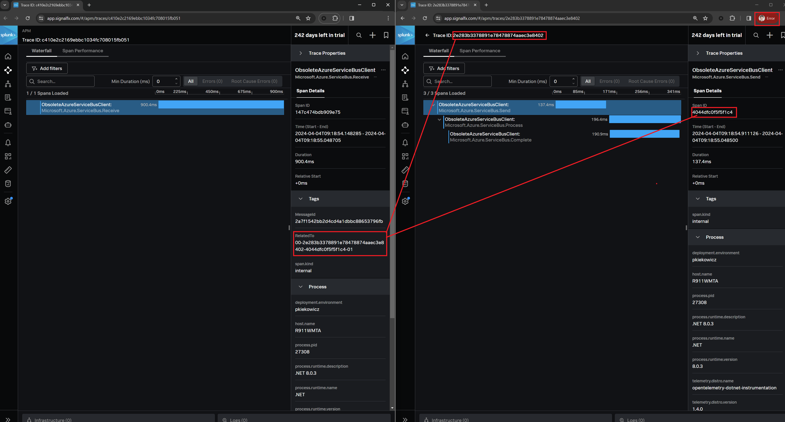

# LegacyAzureServiceBusClientInstrumentation

## Deprecation Notice

`Microsoft.Azure.ServiceBus` nuget package is deprecated.
There is a recommendation to migrate to [`Azure.Messaging.ServiceBus`](https://www.nuget.org/packages/Azure.Messaging.ServiceBus). Instrumentation for new package should work without any changes.

## How to make spans for Microsoft.Azure.ServiceBus

Go to source folder

```cmd
cd .\src\ObsoleteAzureServiceBusClient\
```

Build application with dedicated runtime (here `win-x64`)

```cmd
dotnet build --runtime=win-x64
```

Go to build output

```cmd
cd .\bin\Debug\net8.0\win-x64\
```

Modify `instrument.cmd` file.

After

```cmd
set OTEL_DOTNET_AUTO_RULE_ENGINE_ENABLED=false
```

add

```cmd
set OTEL_DOTNET_AUTO_TRACES_ADDITIONAL_LEGACY_SOURCES=Microsoft.Azure.ServiceBus*
```

or set this environmental variable in any other way.

Execute instrumented application

```cmd
.\splunk-launch.cmd .\ObsoleteAzureServiceBusClient.exe
```

As a result, you will see separate traces but they can be manually correlated.


